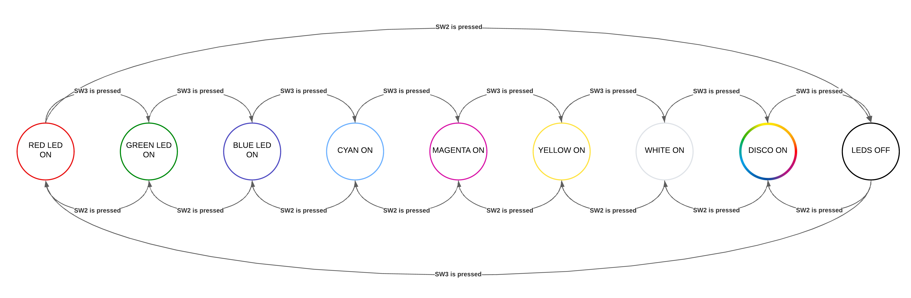

# Create a state machine

## Overview

This project implements a state machine for RGB LEDs using function pointers. Two push buttons (SW2 and SW3) are used as inputs to navigate between states:

- **SW3:** Move forward to the next state
- **SW2:** Move backward to the previous state

Each state corresponds to a specific LED color or behavior. The project demonstrates modular state handling, interrupt-driven button control, and different LED colors.

## Features

- Function-pointer based state machine
- Nine distinct LED states using an RGB LED
- Debounced input using GPIO interrupts
- Ability to implement advanced LED effects 

## State transition diagram

## State transition table

| Current State | SW3 Pressed (Next) | SW2 Pressed (Previous) | LEDs ON                     | Perceived Color   |
|---------------|------------------|-----------------------|-----------------------------|-----------------|
| RED           | GREEN            | OFF                   | Red                         | Red             |
| GREEN         | BLUE             | RED                   | Green                       | Green           |
| BLUE          | CYAN             | GREEN                 | Blue                        | Blue            |
| CYAN          | MAGENTA          | BLUE                  | Green + Blue                | Cyan            |
| MAGENTA       | YELLOW           | CYAN                  | Red + Blue                  | Magenta         |
| YELLOW        | WHITE            | MAGENTA               | Red + Green                 | Yellow          |
| WHITE         | DISCO            | YELLOW                | Red + Green + Blue          | White           |
| DISCO         | OFF              | WHITE                 | Random                      | Disco           |
| OFF           | RED              | DISCO                 | None                        | Off             |
